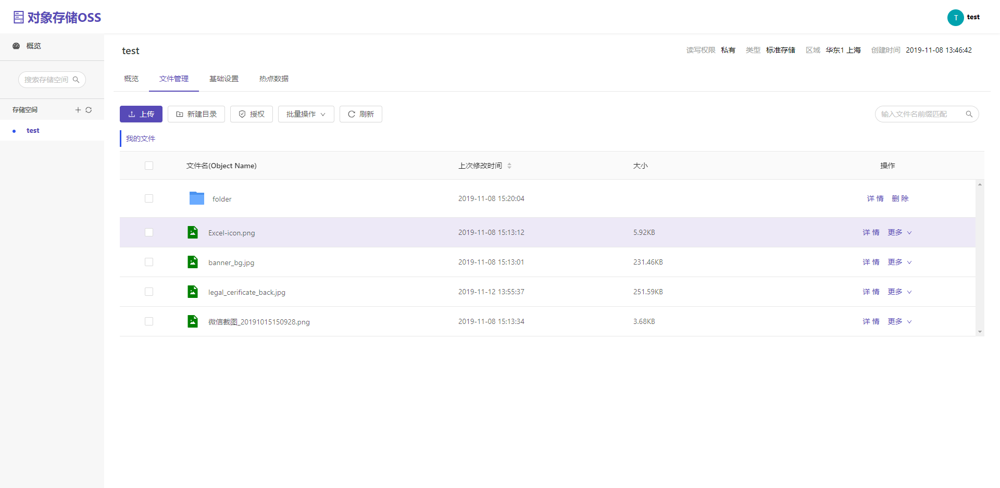

# OSS-对象存储服务

> 仿写阿里云OSS

## 项目demo示例



Demo 示例地址：[www.hicooer.cn](https://www.hicooer.cn)

```text
username: test
password: 123456
```

## QA...

### Q 1.什么是对象存储？

A: 对象存储是一种计算机数据存储体系结构，它将数据作为对象进行管理，而不是将数据作为文件层次结构进行管理的文件系统等其他存储体系结构， 以及将数据作为扇区和轨道内的块进行管理的块存储。每个对象通常包括数据本身，可变数量的元数据和全局唯一标识符。 ------ 来自 [维基百科](https://en.wikipedia.org/wiki/Object_storage)

白话文：将数据视为对象，存入系统后得到全局唯一标识，通常可通过 HTTP 请求进行数据对象的增删改查；

特点：

* 容量水平扩展
* 冗余备份，空间利用率相对传统全备份高，（CPU计算，时间换空间？）

### Q 2.适用场景？

A:

* 图片、视频、音频、日志等海量文件存储
* 其他非结构化数据

### Q 3.怎么用？

> 默认开启 consul 注册发现，不需要可关闭

A:

* 单机模式：（性能容量有限，毕竟是单机，无纠错，无冗余） 启动 oss-backend 项目，将前端项目 oss-front build后 丢到一个 http 服务器下，完。
* 多机模式：（该项目使用 RS\(4 + 2\) 纠错恢复，理论上至少需要 6 台机器，当然，用一台机器跑6个端口也是可行的！） 启动 oss-backend 项目，在 6台服务器上分别启动 oss-data-service 项目，mysql region 配置 ip 端口（没有region 管理。。。）

> 注： oss-backend 也可以用 nginx 负载均衡下 启动多个实例

### Q 4.功能特性？

A:

* 多机模式下，冗余纠错恢复数据，示例中使用 6台服务器，即将数据分片 6 分，分别存储到各机器，RS\(4 + 2\),允许 其中任意 2 台 机器宕机，或者其他原因导致的数据损坏，丢失

  均可恢复原始数据；可接受范围内数据损坏自动修复

* 全局资源唯一，系统将会计算 资源hash，同样的资源在系统中 只会存在一份，实现系统已有资源极速上传；
* 热点数据缓存

## oss-backend 微服务基本项目结构

用到spring boot ，spring-security, mybatis-plus，undertow，druid，logback日志归档，提供swagger接口文档,基础代码自动生成

### 源码src架构

软件架构说明

aop -- 切片方法

api -- 控制器 api 入口

common -- 公共包

config -- 配置类

dao -- 数据库访问层

erasure -- RS 纠错

lock -- 分布式锁

module -- 请求、响应等DTO对象

quartz -- 定时器任务

security -- 访问安全

service -- 业务服务层

### 通用集成服务

邮件异步发送

